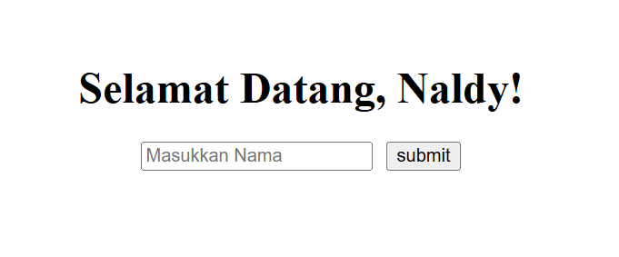

# Project Greeting

This project is for training only. This project implement DOM Form Serialization and utilizing local storage to create a greeting. When the input has already been submitted, the value from the input will be put on the local storage, then when the page reloaded, the greeting would take the value from input before into the greeting page.

## Preview



## How to Run this Project

1. Clone this project
```
git clone https://github.com/mdavindarinaldy/fgo24-dom-localstorage.git
```
2. Run the project

## Dependencies
This project don't have any dependency

## Basic Information
This project is part of training in Kodacademy Bootcamp Batch 24 made by Muhammad Davinda Rinaldy